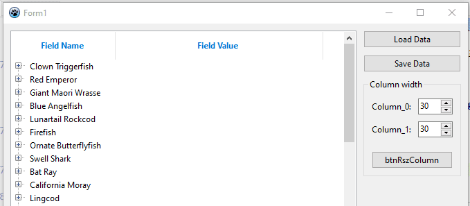

### Test project for vertical grid emulation in VTV

--------
0.0.14
- fix error for *.dat file path for linux
- implemented column width resize by programmaticaly

--------
0.0.13
- changed header height, ~~font style and~~ font color

--------
0.0.12
- fixed *.dat file path for Darwin

--------
0.0.11
- fixed some options for Windows qt5
- added dependency LCLWidgetType for output file name

--------
0.0.10
- fixed some options for Linux OS

--------
0.0.9
- removed incompatible units from project

--------
0.0.8
- removed dbaware components (IBDatabase, IBSQL)

--------
0.0.7
- removed MemDataset component
- implemented save/load BufDataset data to/from file

--------
0.0.6
- implemented save MDS data to file

--------
0.0.5
- implemented (optional) displaying the calculated height for a multiline node
- implemented (optional) collapsing other nodes when expanding the current node

--------
0.0.4
- implemented display of multiline memo-field + tooltip hint

--------
0.0.3
- implemented child nodes display

--------
0.0.2
- implemented data display for the grid

--------
0.0.1
- added biolife table